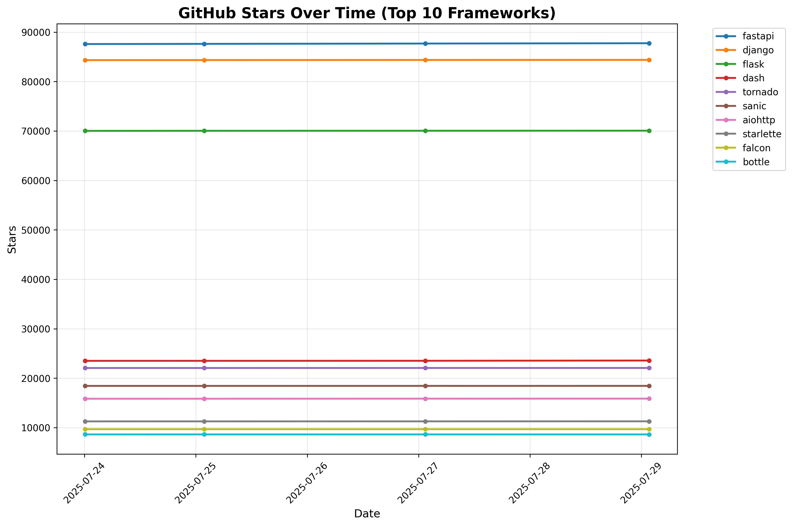
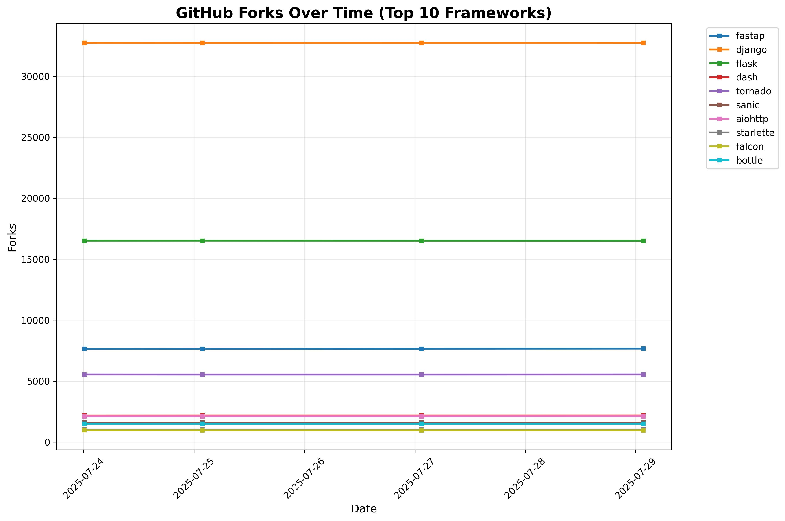

# Top Python Web Frameworks
A list of popular github projects related to Python web framework (ranked by stars automatically)

* UPDATE **list.txt** (via Pull Request)

## 📈 Current Rankings

| Project Name | Stars | Forks | Open Issues | Last Commit |
| ------------ | ----- | ----- | ----------- | ----------- |
| [fastapi](https://github.com/fastapi/fastapi) | 87620 | 7639 | 319 | 2025-07-23 13:02:50 |
| [django](https://github.com/django/django) | 84343 | 32736 | 351 | 2025-07-24 06:39:07 |
| [flask](https://github.com/pallets/flask) | 70036 | 16507 | 14 | 2025-06-12 20:48:07 |
| [dash](https://github.com/plotly/dash) | 23516 | 2178 | 539 | 2025-07-18 17:18:35 |
| [tornado](https://github.com/tornadoweb/tornado) | 22065 | 5532 | 208 | 2025-07-22 20:43:43 |
| [sanic](https://github.com/sanic-org/sanic) | 18446 | 1575 | 140 | 2025-03-31 21:19:26 |
| [aiohttp](https://github.com/aio-libs/aiohttp) | 15851 | 2108 | 252 | 2025-07-24 22:37:42 |
| [starlette](https://github.com/encode/starlette) | 11271 | 1022 | 44 | 2025-07-20 17:29:09 |
| [falcon](https://github.com/falconry/falcon) | 9692 | 960 | 160 | 2025-07-24 06:42:59 |
| [bottle](https://github.com/bottlepy/bottle) | 8635 | 1485 | 282 | 2025-06-27 10:14:03 |
| [hug](https://github.com/hugapi/hug) | 6893 | 389 | 187 | 2023-06-30 13:14:01 |
| [eve](https://github.com/pyeve/eve) | 6731 | 745 | 29 | 2025-06-03 13:00:09 |
| [vibora](https://github.com/vibora-io/vibora) | 5639 | 301 | 140 | 2019-02-11 10:54:12 |
| [pyramid](https://github.com/Pylons/pyramid) | 4039 | 889 | 82 | 2024-12-20 23:21:35 |
| [quart](https://github.com/pallets/quart) | 3369 | 184 | 62 | 2025-06-12 21:05:35 |
| [masonite](https://github.com/MasoniteFramework/masonite) | 2292 | 130 | 20 | 2025-03-20 20:11:49 |
| [web2py](https://github.com/web2py/web2py) | 2151 | 907 | 369 | 2025-07-14 00:48:47 |
| [cherrypy](https://github.com/cherrypy/cherrypy) | 1913 | 369 | 259 | 2025-07-04 16:22:41 |
| [tg2](https://github.com/TurboGears/tg2) | 811 | 80 | 12 | 2025-02-18 22:52:59 |
| [Growler](https://github.com/pyGrowler/Growler) | 688 | 21 | 5 | 2020-03-08 07:51:41 |
| [morepath](https://github.com/morepath/morepath) | 396 | 37 | 77 | 2022-05-29 18:09:39 |
| [circuits](https://github.com/circuits/circuits) | 316 | 57 | 42 | 2024-04-03 22:38:28 |

## 📊 Growth Trends

### Stars Growth Over Time

### Forks Growth Over Time

*Charts show the top 10 frameworks by current star count*

*Last Automatic Update: 2025-07-25T01:48:33*