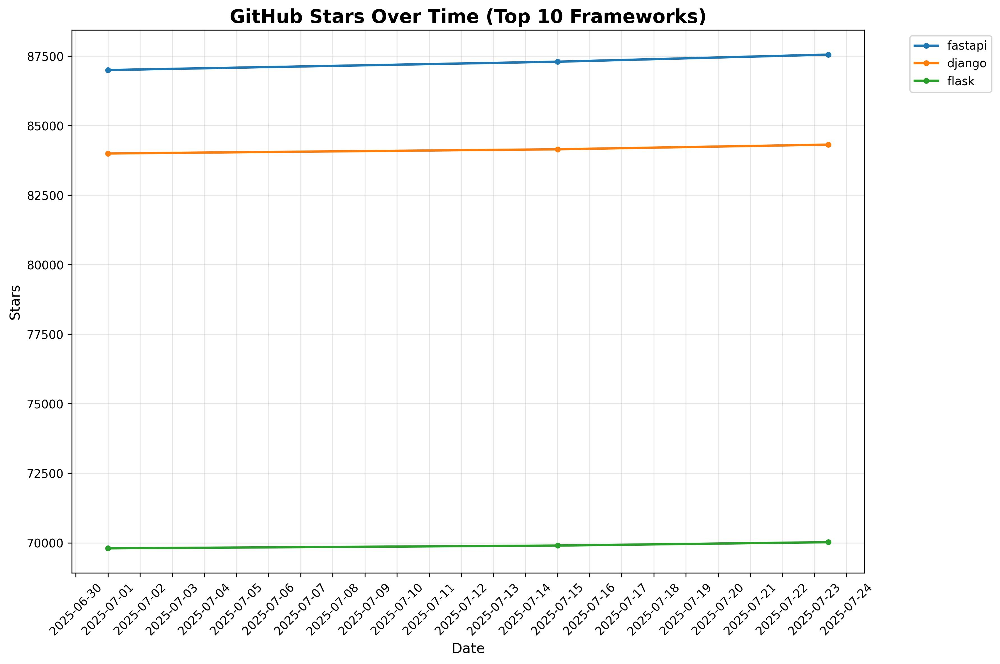
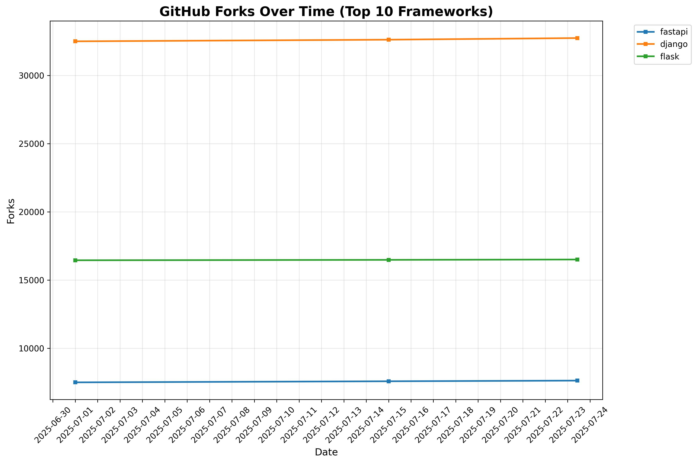

# Top Python Web Frameworks
A list of popular github projects related to Python web framework (ranked by stars automatically)

* UPDATE **list.txt** (via Pull Request)

## 📈 Current Rankings

| Project Name | Stars | Forks | Open Issues | Last Commit |
| ------------ | ----- | ----- | ----------- | ----------- |
| [fastapi](https://github.com/fastapi/fastapi) | 87556 | 7628 | 317 | 2025-07-21 12:21:22 |
| [django](https://github.com/django/django) | 84318 | 32739 | 356 | 2025-07-22 19:29:14 |
| [flask](https://github.com/pallets/flask) | 70021 | 16505 | 14 | 2025-06-12 20:48:07 |
| [dash](https://github.com/plotly/dash) | 23507 | 2175 | 538 | 2025-07-18 17:18:35 |
| [tornado](https://github.com/tornadoweb/tornado) | 22063 | 5533 | 211 | 2025-07-22 20:43:43 |
| [sanic](https://github.com/sanic-org/sanic) | 18445 | 1575 | 140 | 2025-03-31 21:19:26 |
| [aiohttp](https://github.com/aio-libs/aiohttp) | 15849 | 2107 | 253 | 2025-07-21 16:54:06 |
| [starlette](https://github.com/encode/starlette) | 11267 | 1021 | 44 | 2025-07-20 17:29:09 |
| [falcon](https://github.com/falconry/falcon) | 9692 | 960 | 159 | 2025-07-22 19:31:00 |
| [bottle](https://github.com/bottlepy/bottle) | 8633 | 1485 | 282 | 2025-06-27 10:14:03 |

## 📊 Growth Trends

### Stars Growth Over Time

### Forks Growth Over Time

*Charts show the top 10 frameworks by current star count*

*Last Automatic Update: 2025-07-23T18:30:00*